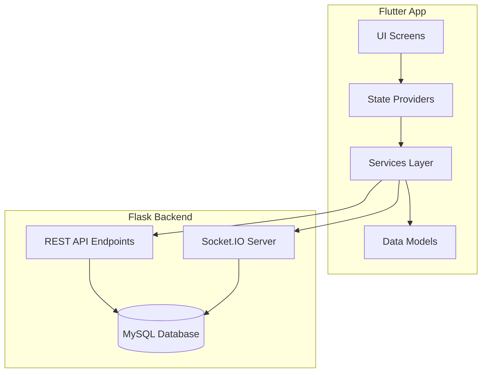

# Design Document: Seller Dashboard Integration

## Overview

This design document specifies the architecture and implementation details for integrating a comprehensive seller dashboard into the Flutter mobile application with Flask backend support. The feature enables sellers to manage their business operations through five distinct phases:

1. **Phase 1**: Dashboard statistics display
2. **Phase 2**: Product and order management
3. **Phase 3**: Profile management
4. **Phase 4**: Real-time chat functionality
5. **Phase 5**: Notifications system

The design follows the existing application architecture patterns:
- **Flutter Frontend**: Provider-based state management with ChangeNotifier
- **Backend Communication**: REST APIs via FlaskApiService and ApiClient
- **Authentication**: JWT token-based authentication
- **Real-time Communication**: Socket.IO for chat functionality

### Key Design Principles

1. **Incremental Delivery**: Each phase delivers standalone value
2. **Consistency**: Follow existing codebase patterns and conventions
3. **Separation of Concerns**: Clear boundaries between UI, state management, and API layers
4. **Testability**: Design components for easy unit and integration testing
5. **Scalability**: Support future enhancements without major refactoring

## Architecture

### High-Level Architecture



### Layer Responsibilities

#### UI Layer (Screens & Widgets)
- Render visual components
- Handle user interactions
- Display loading and error states
- Navigate between screens
- Consume data from Providers via `context.watch<T>()` or `context.read<T>()`

#### State Management Layer (Providers)
- Manage application state
- Coordinate API calls through Services
- Notify UI of state changes via `notifyListeners()`
- Handle loading and error states
- Cache data when appropriate

#### Services Layer
- **FlaskApiService**: HTTP REST API communication
- **SocketService**: Real-time Socket.IO communication
- **ImageUploadService**: Handle multipart file uploads
- Abstract network details from Providers

#### Models Layer
- Define data structures
- Provide JSON serialization/deserialization
- Implement value equality and immutability patterns

### Authentication Flow

```mermaid
sequenceDiagram
    participant App
    participant AuthProvider
    participant ApiClient
    participant Flask
    
    App->>AuthProvider: Login
    AuthProvider->>Flask: POST /auth/login
    Flask-->>AuthProvider: JWT Token
    AuthProvider->>AuthProvider: Store token
    
    App->>ApiClient: API Request
    ApiClient->>AuthProvider: Get token
    AuthProvider-->>ApiClient: JWT Token
    ApiClient->>Flask: Request + Bearer Token
    Flask-->>ApiClient: Response
    ApiClient-->>App: Data
